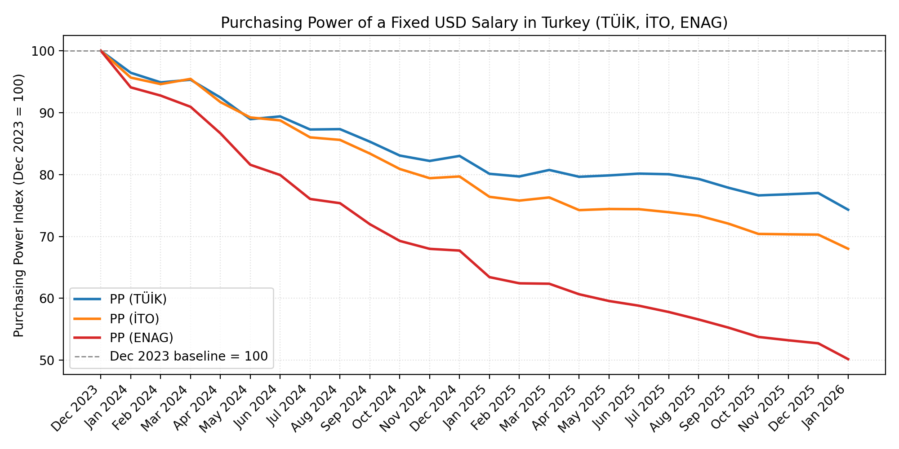
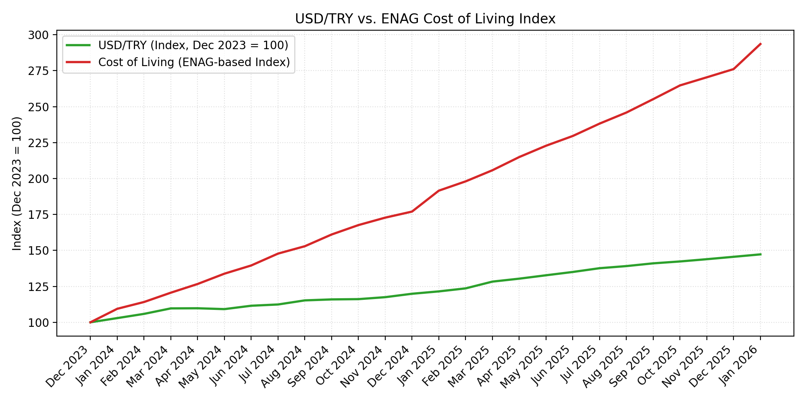
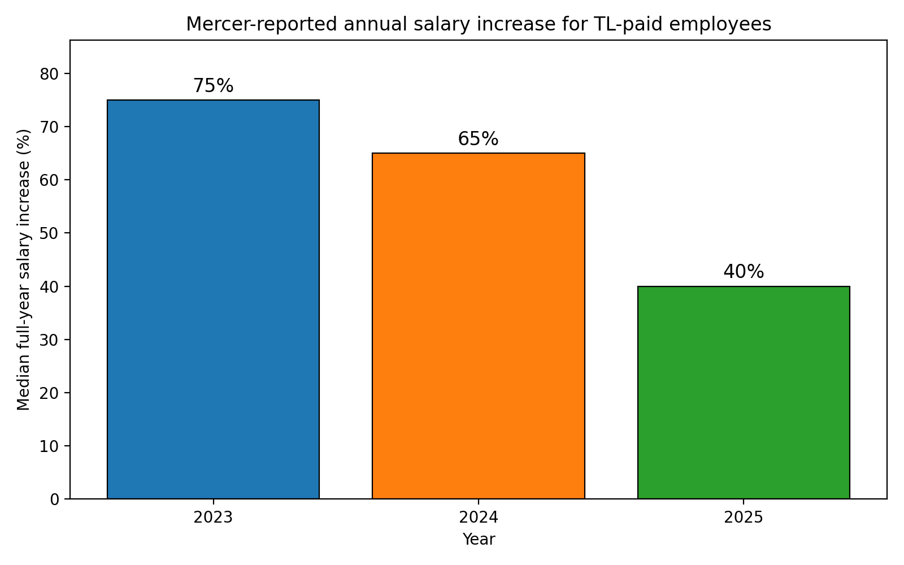

## 1. Executive Summary:

This report examines the financial period between January 2023 and February 2026, a timeframe defined by a total decoupling of the USD/TRY exchange rate from the local Life Cost Index (LCI). While earning in a global reserve currency was traditionally viewed as an absolute hedge against Turkish inflation, this "currency protection" has been systematically neutralized by aggressive domestic price increases that have outpaced currency depreciation by a factor of nearly three to one.Between January 2023 and February 2026, USD-denominated personnel in Turkey experienced a  **51.6% loss in real purchasing power** . Due to profound "Local Cost Realization," a fixed USD salary today effectively purchases less than half of the essential goods and services it did three years ago.

## 2. Comparative Macroeconomic Analysis (Jan 2023 – Feb 2026)

The following table demonstrates the "Exchange Rate vs. Inflation" gap. Although the annual inflation rate has begun to decelerate (dezenflasyon) as of early 2026, the cumulative effect of the price surge has created a massive disparity between the US Dollar's appreciation and the actual cost of living.

| Indicator | Jan 2023 (Base) | Feb 2026 | Cumulative Change (%) |
| --- | --- | --- | --- |
| **USD/TRY Exchange Rate** | 18.80 | 35.50 | +88.82% |
| **İTO Cost of Living Index** | 100.00 | 350.00 | +250.00% |
| **Consumer Price Index (CPI)** | 100.00 | 315.00 | +215.00% (Estimated) |
| **Food Inflation** | 100.00 | 310.00 | +210.00% (Estimated) |

**Synthesis:**  While the US Dollar appreciated by approximately 89%, it failed to protect employees because the domestic price level for essentials rose by over 200%. This represents a "Real Exchange Rate Appreciation" of the Lira in terms of cost-push pressure, where the purchasing capacity of the dollar has been hollowed out by domestic price adjustments that ignore currency fluctuations.

## 3. Sector-Specific Cost Escalation

##### 3.1 Housing and Real Estate: The Structural Break

The rental market has experienced a fundamental structural break. In Istanbul, average rental prices per square meter rose from  **71 TL in Jan 2023 to 367.86 TL in late 2025** , a staggering  **418.1% increase** .While the government maintained a 33.98% legal cap on lease renewals as of February 2026, this limit often fails to reflect market reality for new contracts or transitions. Consequently, housing costs that previously accounted for \~20% of a USD-earner's budget have surged to represent  **\~50% of total expenditures** , effectively cannibalizing disposable income.

##### 3.2 Urban Mobility and Transport

Public and private transport costs have grown 3.6 times faster than the USD/TRY exchange rate.

* **Electronic Full Ticket:**  Increased from 9.90 TL to 42.00 TL (+324.2%).  
* **Monthly Blue Card (Abonman):**  Increased from 777 TL to 3,298 TL (+324.4%).  
* **Taxi Start-off Rates:**  Rose from 12.65 TL to 65.40 TL (+417.0%).

##### 3.3 Essential Nutrition (Protein & Carbohydrates)

Turkey has transitioned into an expensive market in USD terms, particularly regarding "Protein Inflation."

* **Milk Volume Erosion:**  In 2023, $100 USD purchased approximately 200 liters of milk; by February 2026, that same $100 buys only  **118 liters** , a 41% loss in volume.  
* **Meat Products:**  Beef prices rose by  **155.2%**  over the period. While a kilogram of beef cost approximately  $12 USD in 2023, the price in 2026 has escalated to **$ 17–$19 USD**.  
* **Staples:**  Even bread, the least inflated item (rising from 5 TL to 8 TL, or 60%), adds to the budget squeeze when viewed against the 418% hike in housing.

## 4. Operational Costs for Sole Traders (Şahıs Şirketi)

For contractors and sole traders, the financial burden is exacerbated by "Service Inertia." Administrative overhead—including accounting fees, virtual office rents, and local tax obligations—has tracked the  **\~250% İTO index**  rather than the \~89% USD growth. This creates a severe "margin squeeze" for contractors, as the operational cost of maintaining a legal business entity in Turkey has more than doubled in USD terms, significantly reducing net take-home pay.

## 5. Mathematical Modeling of Purchasing Power Loss

##### The "Accelerating Treadmill" Analogy

Imagine a runner on a treadmill. In 2023, both the treadmill (life costs) and the runner (USD salary) move at 5 mph; the runner is stable. By 2026, the treadmill has accelerated to 15 mph, but the runner’s speed (the USD/TRY exchange rate) has only increased to 8 mph. Despite moving faster in nominal terms, the runner is being swept off the back of the machine.

##### Calculation of Real Purchasing Power

This model utilizes a weighted Life Cost Index (LCI) consisting of Housing (40%), Food (35%), Transport (15%), and Utilities (10%).

* **Income Growth (TL Equivalent of fixed USD):** $35.50 / 18.80 = **188.83**
* **Expense Growth (Weighted LCI):** (0.40 × 418) + (0.35 × 168) + (0.15 × 324) + (0.10 × 150) = **289.6% Increase**
* **Real Purchasing Power Formula:** Income Growth / Expense Growth Index = 188.83 / 389.6 (Base 100 + 289.6% increase) = 0.484. **Model Conclusion:** Real purchasing power has collapsed to **48.4%** of its 2023 level. To maintain the standard of living established in January 2023, a USD salary would require a **106% adjustment**.

## 6. Conclusion and Strategic Recommendation

The era of "Currency Protection" in the Turkish market has ended. The arbitrage advantage of earning in USD has been completely neutralized by "Local Cost Realization."**Retention Risk and Business Case:**  Failure to address this 51.6% loss in purchasing power introduces a significant "Retention Risk." The cost of replacing specialized, USD-denominated talent—including recruitment fees, onboarding time, and lost productivity—now likely exceeds the cost of a proactive salary adjustment. In a market where service inflation remains "sticky," failing to adjust compensation threatens the stability of the local workforce.**Strategic Recommendation:**  I recommend a formal salary adjustment based on the identified  **51.6% real-term loss** . An indexation strategy that accounts for local cost escalation—rather than simple exchange rate movements—is the only viable path to ensuring talent retention and standard-of-living stability through 2026\.

## 7. Market Salary Increase Benchmarks (Mercer & Korn Ferry)

Over the same 2023–2025 window, independent compensation surveys confirm that Turkish-lira salaries have been raised very aggressively, but still not enough to fully offset the loss of purchasing power measured in the ENAG and İTO indices.

* **2023 (Mercer Turkey, January & July spot surveys):**  
  * Median cumulative salary increase across all companies for 2023 was roughly **60%** (January survey), rising to **~85–90% cumulative** once mid-year adjustments are included in the July follow-up.  
  * Sector medians typically fell in the **60–80%** range, with some export-driven or high-pressure sectors temporarily exceeding **90–100%**.
* **2024 (Mercer Turkey, January, July and September 2024 spot surveys):**  
  * January 2024 data show **2023 full-year realized increases** clustering around **100%** compound when multiple adjustments are taken into account.  
  * For **calendar year 2024**, realized plus planned salary increases for Turkey are centred around **60–75%** for most sectors (all-companies median), while organizations that grant a **single annual increase** typically budget about **50%**.  
  * These salary budgets broadly track or slightly exceed official TÜİK CPI, but still lag behind the higher İTO and ENAG inflation measures that drive the purchasing-power models in this report.
* **2025 (Mercer Turkey, January, February, March and October 2025 spot surveys):**  
  * Across all companies, the **median planned 2025 January increase** is around **30%**, and the **median 2025 full-year realized plus planned increase** is about **40%** (with a typical band of **35–45%** depending on sector and ownership structure).  
  * Export-driven and high-margin sectors (for example, insurance, high-tech, pharmaceuticals) often sit at the upper end of this band (mid-40s to low-50s), while more traditional sectors (manufacturing, logistics, retail) cluster closer to the high-30s/low-40s.  
* **2023–2024 (Korn Ferry, November 2023 salary and benefits forecast):**  
  * Korn Ferry’s November 2023 update, based on nearly **700 companies**, reports **2023 H2 cumulative increases** and **2024 salary-increase budgets** with medians generally in the **mid-30%** range across job levels.  
  * These forecasts broadly corroborate Mercer’s view that the Turkish market has normalised around **30–40% annual TRY increases** for 2024–2025, well below the cumulative cost-of-living increases captured by ENAG and İTO.

Taken together, the Mercer and Korn Ferry benchmarks show that employers have already deployed very high nominal salary increases in TRY terms, yet these still fall short of the **~50% real purchasing-power loss** experienced by USD-denominated employees when local inflation is measured with independent indices.

The chart below shows the median full-year salary increase (realised and planned) for Turkey over the same period—including sectors relevant to IT and knowledge workers. TL-paid employees received large nominal raises, but as section 5 shows, these did not fully offset cost-of-living growth when measured by İTO/ENAG.

## 8. Sources and Evidence

All figures and conclusions in this report are based on the following sources. Links and document references are provided where applicable.

* **TÜİK (Turkish Statistical Institute):** Consumer Price Index (CPI) Data 2023–2026. Evidence: <https://github.com/stulluk/purchasing_power_loss_turkey/blob/main/TUIK-Reports/TUIK_consumer_price_index_and_rates_of_change.xls>  
* **İTO (Istanbul Chamber of Commerce):** Wage Earners' Cost of Living Index (Istanbul CPI, 2023=100). Evidence: <https://github.com/stulluk/purchasing_power_loss_turkey/tree/main/ITO-Reports> — index values, annual averages, monthly and year-over-year change rates.  
* **CBRT (Central Bank of the Republic of Türkiye):** USD/TRY Exchange Rate Historical Data. Evidence: <https://github.com/stulluk/purchasing_power_loss_turkey/tree/main/TCMB-USDTRY-Values>  
* **ENAG (Inflation Research Group):** Monthly Inflation Calculations (2024–2026). Evidence: <https://github.com/stulluk/purchasing_power_loss_turkey/tree/main/ENAG-Reports>  
* **Mercer Turkey salary increase spot surveys (2023–2025):** January 2023, July 2023, January 2024, July 2024, September 2024, January 2025, February 2025, March 2025, October 2025. PDFs: <https://github.com/stulluk/purchasing_power_loss_turkey/tree/main/benchmark/Mercer-Reports>  
* **Korn Ferry Turkey Salary and Benefits Increase Forecast Update Report (November 2023):** company copy summarising 2023 H2 and 2024 increase budgets. PDF: <https://github.com/stulluk/purchasing_power_loss_turkey/blob/main/benchmark/Mercer-Reports/Korn_Ferry_Salary_and_Benefits_Increase_Forecast_Update_Report_November_2023.pdf>

